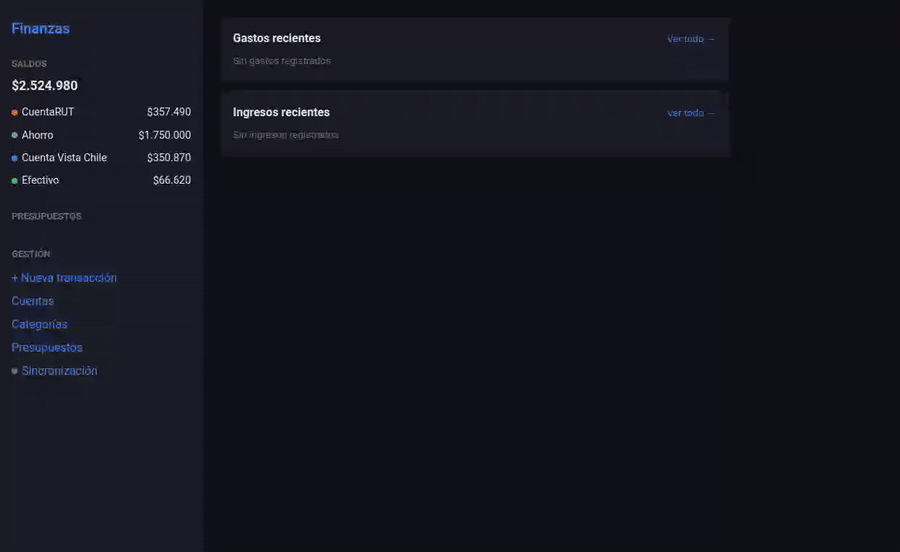
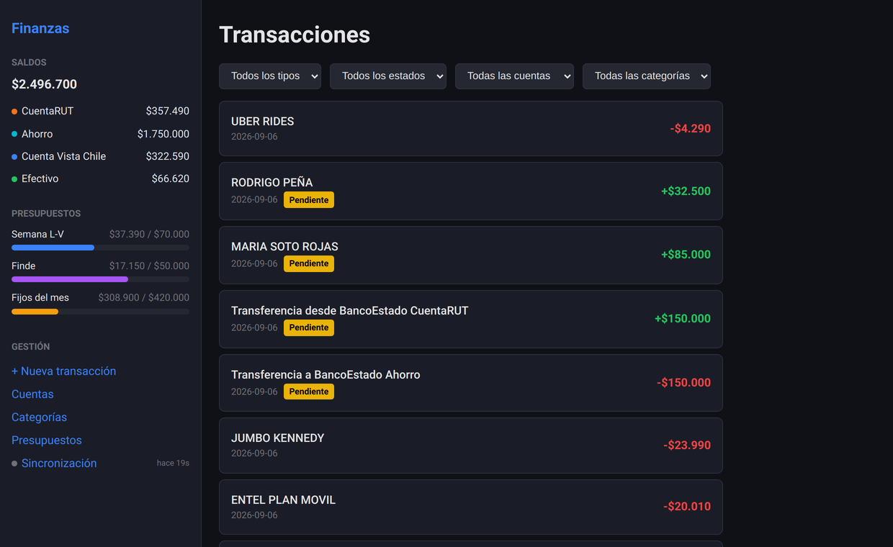
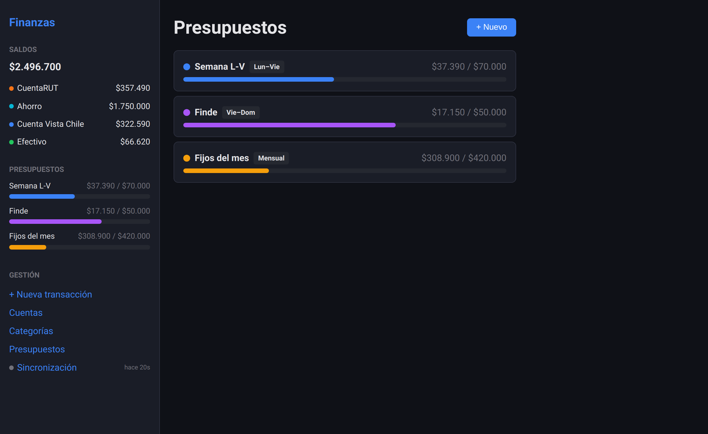
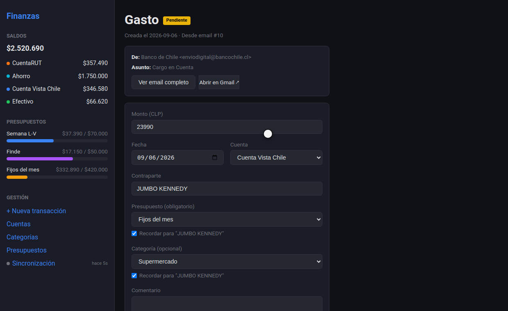
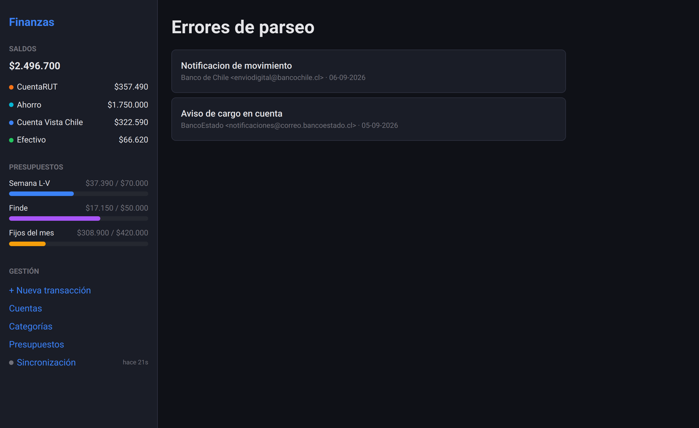

# Finanzas

Personal finance webapp that reads Chilean bank transaction emails from Gmail,
parses them per-bank, and turns them into pending transactions to confirm and
assign to a budget. Built for real personal use, not a demo — it's been
running in production tracking my own accounts.



*One sync turns a batch of bank emails into transactions: one is auto-confirmed
by a saved rule, one email produces two transactions (a transfer between my own
accounts), one email the parsers don't understand goes to an error queue, and a
newsletter is skipped. Confirming a transaction moves both the account balance
and the budget period.*

## Try it — no bank account, no Gmail credentials

```bash
docker compose -f docker-compose.demo.yml up --build   # → http://localhost:8080
```

Demo mode ships a fake Gmail inbox (`backend/app/demo/`) with sample emails from
each supported bank, so the **Sincronizar ahora** button runs the real
sync → parse → transaction pipeline end to end. The database comes seeded with
about four weeks of movements. To start over:

```bash
docker compose -f docker-compose.demo.yml exec api python -m app.scripts.seed_demo --reset
```

## Stack

- **Backend**: FastAPI, SQLAlchemy 2.x, Alembic, psycopg3, Python 3.12
- **Frontend**: React 19 + Vite, plain CSS (no framework)
- **DB**: Postgres 16
- **Deploy**: Docker Compose + Caddy, systemd timer for hourly Gmail sync

## How it works

1. An hourly systemd timer (or the sync button) fetches new Gmail messages.
2. A registry of transactional sender addresses filters out everything that
   isn't a movement notification — the rest is marked `SKIPPED`.
3. One parser per bank turns the email HTML into amounts, counterparts and
   dates. An email that no parser can read is kept and surfaced in
   `/errors` to be resolved by hand instead of being silently dropped.
4. Each transaction is routed to the right account (by the last 4 digits of the
   account number, falling back to the bank name) and lands as `PENDING`.
5. Saved rules can pre-fill category and budget for a known counterpart, or
   confirm it outright. Confirming applies the amount to the account balance
   and to the current budget period.

Four banks are supported today: Banco de Chile/Edwards, BancoEstado, BCI and
Banco Falabella.

## Screenshots

| | |
|---|---|
|  |  |
| Transaction feed with filters | Budgets by period (weekday, weekend, monthly) |
|  |  |
| A transaction with the email that produced it | Emails no parser could read |

The layout collapses into a drawer on phones — [mobile view](docs/media/mobile.png).

## Quickstart (development)

```bash
docker compose up -d          # api + postgres, api on :8000
cd frontend && npm run dev    # dev server, proxies /api to :8000
```

Backend needs Gmail OAuth credentials in `credentials/gmail_token.json` to
actually fetch emails (see `docs/DESARROLLO.md` for how to generate one) —
without it, everything except the sync feature works against an empty DB.
For a fully working app without credentials, use the demo stack above.

## More

Architecture, the parser system (how a bank email becomes a transaction),
account routing rules, the deploy runbook, and a debugging playbook live in
[`docs/DESARROLLO.md`](docs/DESARROLLO.md).
